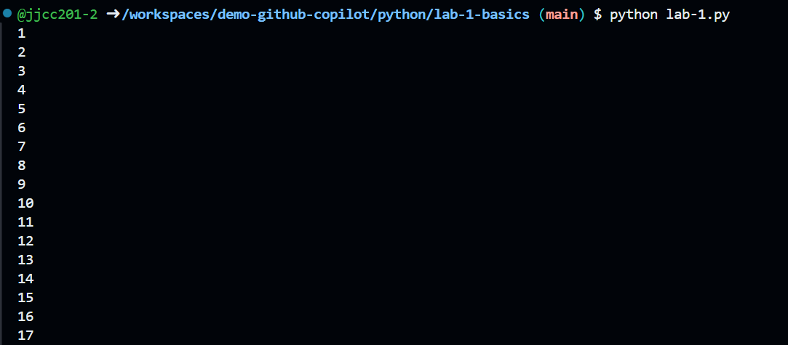

 #  Lab 1: Basics of GitHub Copilot
 
 In this lab, we will focus on accessing GitHub Copilot. We will explore the following:   
 1. Accessing GitHub Copilot via in-line 
 2. Accessing GitHub Copilot via chat window
 3. Changing the large language model used by GitHub Copilot
 
 You will see in this lab folder a Python file called `lab-1.py`. We're going to create some very basic functions that perform maths operations


---


## Accessing GitHub Copilot via In-Line Chat
Lets start with the quickest method to accessing GitHub copilot, which is via in-line chat. This allows you to ask questions or request code snippets directly in the code editor. You can do this by typing `ctrl-i` or `cmd-i` on Mac, which will open a small chat window in the editor. You can then type your question or request, and GitHub Copilot will respond with relevant code snippets or explanations.

Opening in-line chat will look like this:


## Accessing GitHub Copilot via Chat Window
The second method to access GitHub Copilot is via the chat window. This is a more comprehensive interface that allows you to have a full conversation with GitHub Copilot. You can ask questions, request code snippets, or even have discussions about programming concepts. Another difference is that you will see your chat history in the chat window.

You're also able to switch modes between `Ask` and `Agent` in the chat window. We'll explore the differences between these modes in another lab. 


## Task 0: Pre-Reqs
- Ensure you have followed the setup instructions in the `README.md` file
- Go to your terminal and run command
```bash
   cd python/lab-1-basics
```

> **Note:** We will be using GPT-4.1 as our model for this lab. GPT-4.1 and GPT 4o are considered `standard` models. Stick to these models for this lab.
--- 

## Task 1: Listing Numbers

### Objective
You will see in this lab folder a Python file called lab 1. We're going to create a function that lists numbers from 1 to 100.


### Instructions

- Go to `Task 1: Listing Numbers` in the `lab-1.py` file and click under the comment.
- Click `ctrl-i` or `cmd-i` on Mac to open the inline chat
- On the right-side of the in-line chat, you will see the model that is being used. Set it to `GPT-4.1` or `GPT-4o`.
- Then ask GitHub Copilot to perform the following:
```txt
create a function that will list numbers 1 to 100. Then call the function
```

GitHub Copilot should respond with a code snippet that lists numbers from 1 to 100. 
- Press `accept` in the inline chat or to accept the code snippet.
- Save your changes to the `lab-1.py` file.
- Go to the terminal and run the command:
```bash
python lab-1.py
```

### Output and Cleanup

Hopefully, you should see the output of numbers from 1 to 100 printed in the terminal. It should look something like this:


To clean up, remove the code snippet that was created by GitHub Copilot. This will avoid cluttering the terminal for later.

---

## Task 2: Prime Numbers

### Objective
Lets run the same process that we did for the previous task, but this time we will ask GitHub Copilot to create a function that will list all prime numbers, based on a given number input. 

### Instructions

- Go to `Task 2: Prime Numbers` in the `lab-1.py` file and click under the comment.
- Click `ctrl-i` or `cmd-i` on Mac to open the inline chat
- Then ask GitHub Copilot to perform the following:
```txt
create a function will list prime numbers based on a given number input. Then call the function with an input of 10.
```

GitHub Copilot should respond with a code snippet. This will likely be more complex than the function in the preivous task. 
- Press `accept` in the inline chat or to accept the code snippet.
- Save your changes to the `lab-1.py` file.
- Go to the terminal and run the command:

```bash
python lab-1.py
```
> **Note:** With GitHub Copilot, you won't get the exact same code every time you ask the same question. The AI model may generate different code snippets based on the context and previous interactions.

### Output and Cleanup

You should see an output of "2,3,5,7" printed in the terminal. Feel free to change the input number to see how the output changes.

- Clean up the file by removing the code snippet that was created by GitHub Copilot

---

## Task 3: Regular Expressions

### Objective
Lets repeat the process one last time. For this task we will create a function that will use regular expressions to validate an email address. This time we will access GitHub Copilot via the chat window instead of in-line.


### Instructions
1. Go to `Task 3: Regular Expressions` in the `lab-1.py` file and click under the comment.
2. If using VS Code, click on the GitHub Copilot icon at the top (to the right of the search bar) to open the chat window.
3. Navigate to the bottom of the chat window and you will see the 'mode' and 'model' drop down options. Set to `Ask` mode and `GPT-4.1` model if available.
<br>

4. Then ask GitHub Copilot to perform the following:
```txt
create a function that uses regular expressions to validate an email address. It should print "Valid email" if the email is valid, and "Invalid email" if it is not. Then call the function twice. Once with the input of "alex_wilber@contoso.com" and the other with "alex_wilber@contoso"
```

GitHub Copilot should respond with a code snippet that includes a regex pattern. You may see that the module `re` is imported at the top of the file. This is to be expected.

Since we're in `ask` mode, GitHub Copilot will not automatically insert the suggested code into the file. 
1. Copy the code provided in the chat window and paste under the task 3 comment.
2. Save your changes to the `lab-1.py` file.
3. Go to the terminal and run the command:
```bash
python lab-1.py
```

### Output and Cleanup
Based on the inputs you provided, you should see the output of "Valid email" for the first input and "Invalid email" for the second input.
- If you'd like to test this further, you can change the email addresses in the function call to see how the output changes.
- Clean up the file by removing the code snippet that was created by GitHub Copilot

> **Note:** If the code in this task or in any other tasks does not work as expected, you can always ask GitHub Copilot for help by typing `ctrl-i` or `cmd-i` and asking for clarification or a different approach.


---

## Task 4: Using other Large-Language Models
You may have noticed when using the inline chat that on the right side, it shows you the model that is being used.
- You can change the model by clicking on the model name and selecting a different one.
- For example, you can switch to `GPT-4.1` or `Claude Sonnet 3.5` if available.
- Try re-running the previous tasks with a different model to see how the responses vary.

> **Note:** Only a limited number of models will be available to you if using the free version of GitHub Copilot. You can view the available models in the settings of your IDE or in the GitHub Copilot documentation. At this time be careful of using other models not listed in this lab, as they may use up more of your free usage quota.

---

## Additional Ideas:
That's the end of the first lab. Excellent work! Feel free to move on to the next lab. If you want to continue practicing with some of the concepts you learned in this lab, here are some additional ideas:

- Create a function that calculates the factorial of a number.
- Create a function that can validate a phone number. 